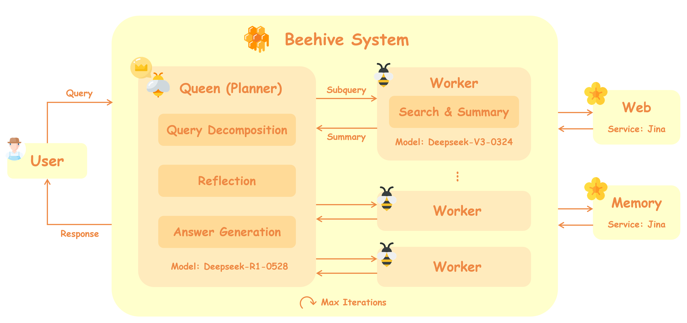

# Beehive: An Efficient Multi-Agent Research System

蜂巢（Beehive）是一个基于多智能体协作与多轮高效推理检索的深度研究系统。系统由负责任务规划、推理反思、答案生成的主智能体Planner，以及负责工具调用、知识检索、内容总结、内存管理的多个子智能体Worker组成。当用户提交查询请求后，Planner首先仔细分析用户需求，并将原查询分解成若干独立的子查询。随后系统将创建相应数量的Worker处理对应的子查询，Worker将在系统知识库和网络中搜索相关知识，并总结提炼出与原查询最相关的信息交付给Planner。Planner随后根据自身知识以及现有信息分析当前是否能够回答原查询，若可以回答，则生成最终答案并给出推理依据与信息来源；若不能回答，则推理分析当前还缺少哪些方面的信息，并生成新的子查询分配给Worker处理。系统将重复上述过程直至得到最终答案或达到最大迭代次数，若达到最大迭代次数，系统将根据当前获得的信息强制生成回答。



## 🚀 核心特性

- **🧠 智能推理**: 基于DeepSeek-R1模型的多轮推理循环
- **🔍 多源检索**: 知识库检索 + 网络搜索的混合检索策略  
- **📝 智能摘要**: 支持分块并行处理的长文档摘要
- **🔄 自适应路由**: 根据相关性自动选择最佳信息源
- **💾 记忆管理**: 持久化存储推理历史和上下文

## 🏗️ 代码结构

```
Multi-Agent-DeepResearch/
├── main.py                    # 系统入口和主控制器
├── config.py                  # 系统配置文件
├── requirements.txt           # 依赖包列表
├── setup.sh                   # 一键安装脚本
├── evaluate.py               # FRAMES基准评测脚本
│
├── agent/                     # 主智能体模块
│   └── main_agent.py         # 核心推理循环控制器
│
├── planner/                   # 推理规划模块
│   ├── planner.py            # DeepSeek推理调用器
│   └── prompt_templates.py   # 推理提示模板
│
├── tools/                     # 工具模块
│   ├── __init__.py
│   ├── search_tool.py        # 知识库搜索工具
│   ├── web_search_tool.py    # 网络搜索工具
│   └── summarizer_tool.py    # 智能摘要工具
│
├── retriever/                 # 检索系统
│   ├── embedder.py           # 文本嵌入服务
│   ├── build_index.py        # 索引构建工具
│   └── retriever.py          # 向量检索器
│
├── reranker/                  # 重排序模块
│   └── reranker.py           # 结果重排序器
│
├── memory/                    # 记忆管理
│   └── memory_manager.py     # 对话历史管理器
│
└── data/                      # 数据目录
    ├── knowledge_base/        # 知识库文档
    ├── index/                 # FAISS向量索引
    ├── memory_cache/          # 记忆缓存
    └── evaluation_results/    # 评测结果
```

## ⚡ 快速开始

### 1. 环境准备

```bash
# 克隆项目
git clone https://github.com/DIONG666/Beehive.git
cd Multi-Agent-DeepResearch

# 设置API密钥（config.py中已设置默认密钥，仅供项目考核时使用）
export DEEPSEEK_API_KEY="your_deepseek_api_key"
export JINA_API_KEY="your_jina_api_key" 

# 一键安装
bash setup.sh
```

### 2. 基础使用

```bash
# 单次查询
python main.py --query "人工智能的最新发展趋势是什么？"

# 交互模式
python main.py --mode interactive

# 包含指定链接的查询
python main.py --query "请分析 https://en.wikipedia.org/wiki/Machine_learning 这篇文章的主要内容"
```

### 3. 系统评测

```bash
# 运行FRAMES基准评测
python evaluate.py
```

## 🔧 系统配置

在 `config.py` 中可以调整以下参数：

### API配置
```python
DEEPSEEK_API_KEY = "your_api_key"      # DeepSeek API密钥 (必需)
JINA_API_KEY = "your_jina_key"         # Jina API密钥 (可选)
```

### 推理参数
```python
MAX_ITERATIONS = 3                     # 最大推理轮次
MAX_CONTEXT_LENGTH = 8192             # 最大上下文长度
TEMPERATURE = 0.7                      # 智能体生成温度
```

### 检索参数
```python
TOP_K = 20                            # 检索文档数量
RERANK_TOP_K = 5                      # 重排序后保留数量
EMBEDDING_DIM = 2048                  # 嵌入维度
```

## 📊 使用示例

### 示例1: 简单问答
```python
system = MultiAgentResearchSystem()
result = system.research_query("什么是量子计算？")

print(result['answer'])      # 答案内容
print(result['citations'])   # 引用来源
```

### 示例2: 链接分析
```python
query = """
请分析以下文章的主要观点：
https://en.wikipedia.org/wiki/Artificial_intelligence
https://en.wikipedia.org/wiki/Machine_learning
"""

result = system.research_query(query)
# 系统会自动提取链接内容并进行综合分析
```

### 示例3: 交互式研究
```python
# 启动交互模式
python main.py --mode interactive

# 系统会提供持续的对话界面
> 请介绍深度学习的发展历程
> 它与传统机器学习的区别是什么？
> 请推荐一些学习资源
```

## 📄 许可证

本项目采用 MIT 许可证。详见 [LICENSE](LICENSE) 文件。

## 🙏 致谢

感谢以下开源项目和服务：

- [DeepSeek](https://www.deepseek.com/) - 强大的推理语言模型
- [Jina AI](https://jina.ai/) - 高质量的嵌入和重排序服务  
- [FAISS](https://github.com/facebookresearch/faiss) - 高效的向量相似度搜索
- [FRAMES](https://huggingface.co/datasets/google/frames-benchmark) - 多步推理评测基准
